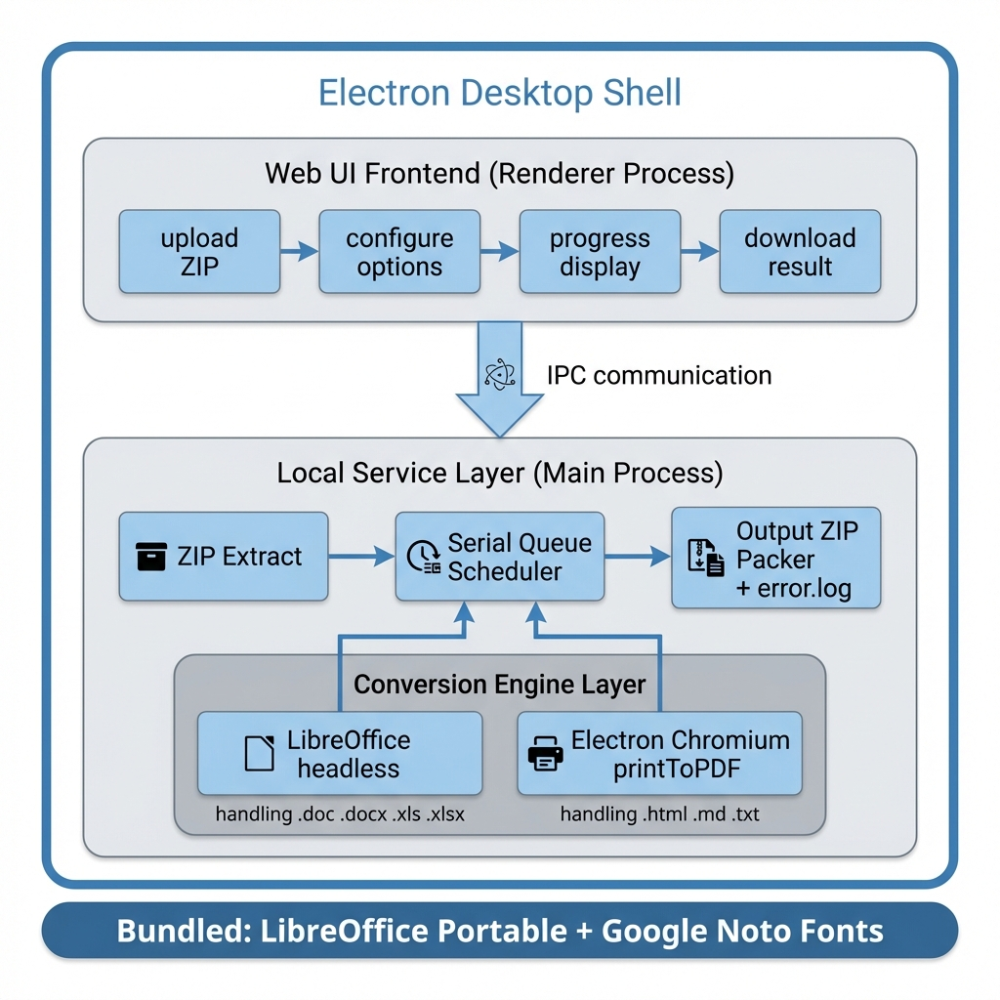
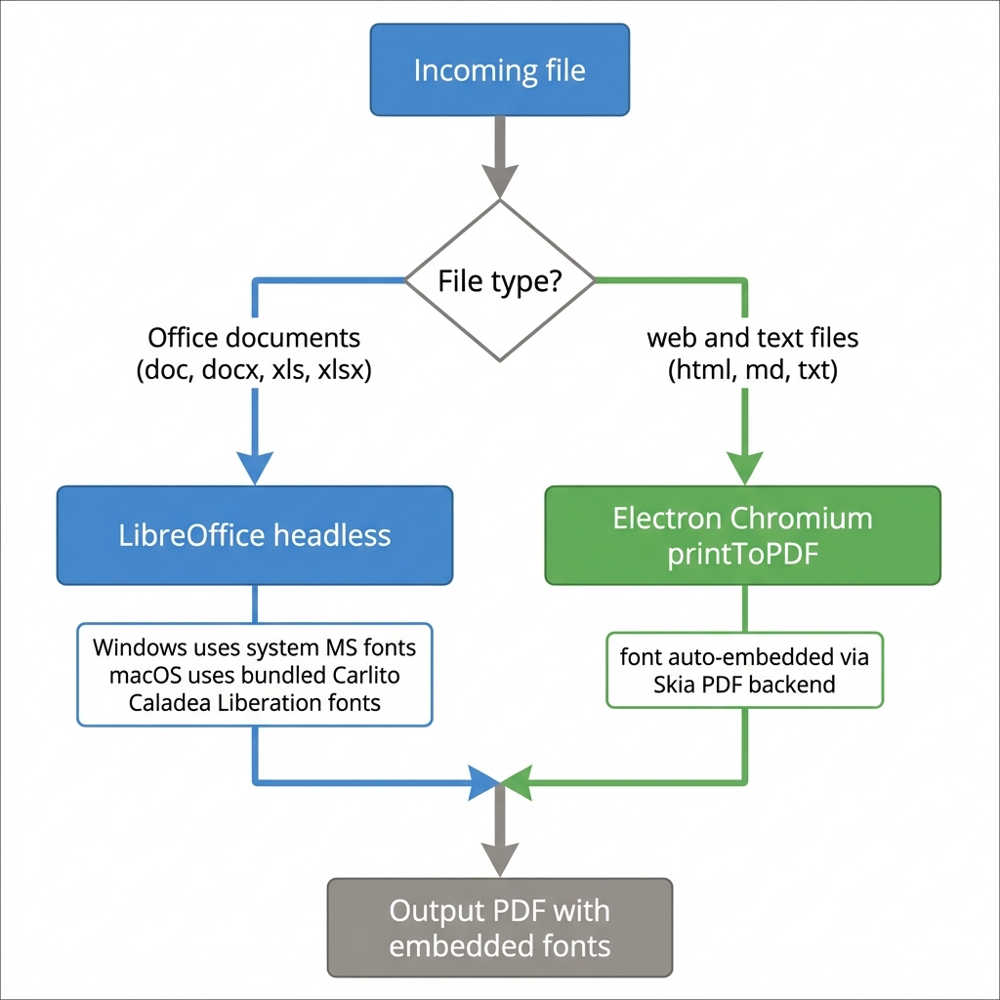
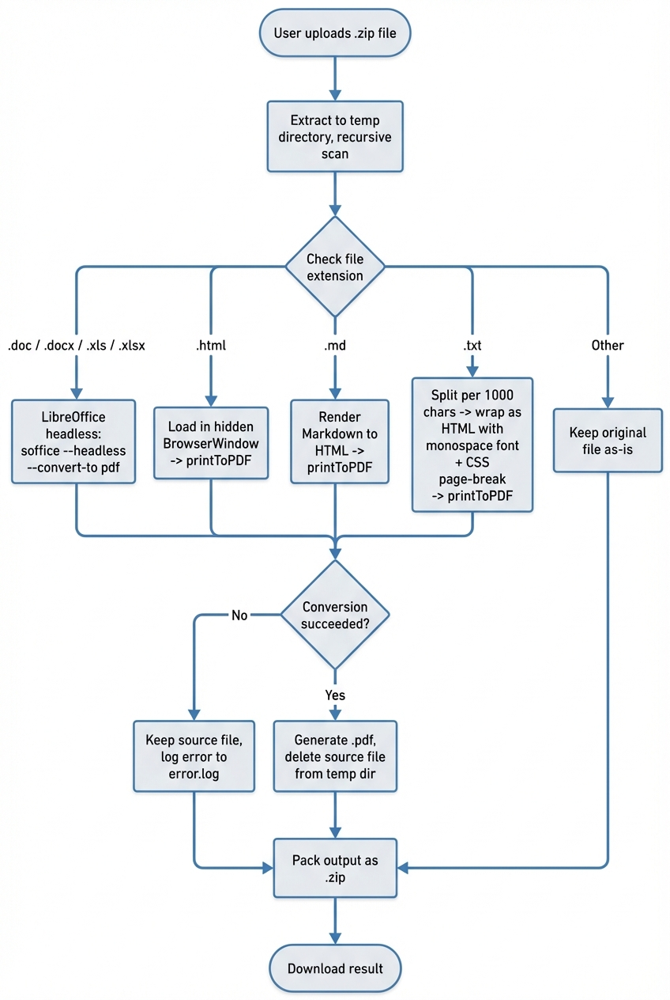

# 批量文档转 PDF 桌面工具 — 产品需求文档（PRD）

> **文档版本**: v1.1  
> **最后更新**: 2026-04-01

---

## 目录

1. [产品概述](#1-产品概述)
2. [技术选型与架构](#2-技术选型与架构)
3. [输入输出规格](#3-输入输出规格)
4. [转换引擎与渲染策略](#4-转换引擎与渲染策略)
5. [各格式专项规则](#5-各格式专项规则)
6. [字体与国际化](#6-字体与国际化)
7. [桌面应用与分发](#7-桌面应用与分发)

---

## 1 产品概述

### 1.1 产品定位

提供一款**跨平台（Windows / macOS）桌面应用**，支持将多种文档、网页及纯文本文件**批量转换为 PDF**，满足以下核心指标：

| 指标 | 要求 |
|------|------|
| 排版保真度 | 转换结果在分页、表格、图片、基本布局上与源文档视觉效果基本一致；Office 文档以接近 Office 原生打印/导出效果为目标 |
| 字体完整性 | 不得出现黑色方块或乱码；缺失字体时自动回退至内置字体 |
| 字体嵌入 | 输出 PDF 必须嵌入字体（Chromium 链路强制嵌入；LibreOffice 链路尽最大努力并提供检测与告警） |

### 1.2 架构与交付形态

- **前后端分离**
  - 前端：Web UI，运行于 Electron 内嵌浏览器（Renderer Process）
  - 后端：Node.js 本地服务层（Main Process），负责文件解压、转换调度与 PDF 生成
- **离线优先**：所有转换均在用户本机完成，不依赖公网后端服务器
- **CI 支持**：支持通过 CI（如 GitHub Actions）一键构建并产出 Windows 安装包与 macOS 应用包

---

## 2 技术选型与架构

### 2.1 整体架构

### 2.2 桌面框架：Electron

| 考察项 | Electron | Tauri | 结论 |
|--------|----------|-------|------|
| 内置 Chromium | 有，可复用做 HTML/MD/TXT → PDF | 无，依赖系统 WebView | Electron 优 |
| printToPDF API | 成熟（`webContents.printToPDF()`） | 无此 API（feature request 自 2022 年未实现） | Electron 优 |
| 字体嵌入 | Skia PDF 后端自动子集化嵌入 | 取决于系统 WebView 版本 | Electron 优 |
| 包体大小 | ~150MB 起 | ~10MB 起 | Tauri 优 |

**决策**：选择 Electron。自带 Chromium 可直接复用做 HTML / Markdown / TXT 转 PDF 转换，无需额外打包 headless Chrome。包体大小不是本项目的核心约束。

### 2.3 Office 文档转换：全平台统一 LibreOffice headless

**决策**：所有平台（Windows / macOS）统一使用 LibreOffice headless，不走 Windows COM 自动化路径。

放弃 COM 自动化的原因：

| 问题 | 说明 |
|------|------|
| 官方不支持 | 微软明确表示"不推荐、不支持非交互环境下的 Office COM 自动化" |
| 模态对话框 | Office 弹出错误对话框时进程挂死，无法自动关闭 |
| 单线程限制 | COM 不可重入，无法扩展 |
| 依赖前提 | 需要用户已安装并授权 Microsoft Office |
| 维护成本 | 双引擎路径（COM + LibreOffice）使架构复杂度翻倍 |

LibreOffice 在 Windows 上可直接使用系统已安装的 Microsoft 字体（Calibri、Arial 等），转换效果接近原生 Office 导出。

**放弃纯库方案（pandas、python-docx、Node.js docx-pdf 等）的原因**：这些库是数据解析器而非渲染引擎，无法保留格式、图表、合并单元格、图片，不满足排版保真度要求。

### 2.4 HTML / Markdown / TXT 转换：Electron 内置 Chromium

利用 Electron 的 `webContents.printToPDF()`，字体通过 Skia PDF 后端自动子集化嵌入。采用串行队列避免 Electron 在并发场景下的性能劣势。

### 2.5 引擎选择决策

### 2.6 后端语言：Node.js

与 Electron 天然集成（Main Process），无需额外运行时依赖。通过子进程调用 LibreOffice CLI。

---

## 3 输入输出规格

### 3.1 输入

| 项目 | 说明 |
|------|------|
| 输入方式 | 用户通过 UI 上传 `.zip` 压缩包 |
| 解压处理 | 在本地解压后按原目录结构进行递归扫描与转换 |

### 3.2 支持的源文件类型

| 类别 | 扩展名 | 转换引擎 |
|------|--------|----------|
| Word | `.doc`、`.docx` | LibreOffice headless |
| Excel | `.xls`、`.xlsx` | LibreOffice headless |
| HTML | `.html` | Electron Chromium printToPDF |
| Markdown | `.md` | Markdown → HTML → Chromium printToPDF |
| 纯文本 | `.txt` | 1000 字符分页 → HTML → Chromium printToPDF |

> 不在上述列表中的文件类型不做转换，默认原样保留在输出包中（是否保留可通过配置开关控制）。

### 3.3 输出

- **目标格式**：PDF（固定）
- **目录结构**：输出保持与源 zip 完全一致的目录层级

### 3.4 转换流程

### 3.5 单文件输出规则

| 场景 | 行为 |
|------|------|
| 转换成功 | 在原文件所在目录生成同名 `.pdf`，随后删除**解压目录内**的源文件（不影响用户原始 zip） |
| 转换失败 | 保留原始源文件不删除，继续处理后续文件（不中断批量任务） |

### 3.6 失败处理与日志

- 批量任务中任一文件转换失败**不中断**整体流程
- 在输出 zip 根目录生成 `error.log`，每条记录包含：
  - 失败文件相对路径
  - 文件类型
  - 使用的转换引擎
  - 错误信息（含堆栈 / 退出码 / 时间戳）

---

## 4 转换引擎与渲染策略

### 4.1 一致性目标

不要求像素级完全一致，但需确保分页、表格、图片、基本布局尽量保持，不出现明显错位或内容缺失。

### 4.2 引擎选择矩阵

| 文件类型 | 转换引擎 | 调用方式 |
|----------|----------|----------|
| Word（`.doc` `.docx`） | LibreOffice headless | `soffice --headless --convert-to pdf` |
| Excel（`.xls` `.xlsx`） | LibreOffice headless | `soffice --headless --convert-to pdf` |
| HTML（`.html`） | Electron Chromium | `webContents.printToPDF()` |
| Markdown（`.md`） | Markdown 渲染 + Chromium | 渲染为 HTML 后 `printToPDF()` |
| 纯文本（`.txt`） | 文本处理 + Chromium | 切分包装为 HTML 后 `printToPDF()` |

### 4.3 并发策略

- 默认采用**队列串行执行**，优先保障稳定性与输出一致性
- LibreOffice 单实例限制 + Electron 并发性能劣势，不建议启用并发转换

---

## 5 各格式专项规则

### 5.1 Excel — 多 Sheet 处理

提供 UI 开关：**是否按 Sheet 拆分为多个 PDF**。

| 开关状态 | 行为 |
|----------|------|
| 关闭（默认） | 整个工作簿导出为单个 PDF，各 Sheet 依次输出 |
| 开启 | 每个 Sheet 独立导出，命名规则：`{原文件名}_{SheetName}.pdf` |

Sheet 拆分命名规范：

- `SheetName` 需做文件名安全清洗（非法字符替换为 `_`）
- 若清洗后出现重名，依次追加 `(1)`、`(2)` … 保证唯一性

> 实现提示：使用 JS 库（如 `xlsx` / `exceljs`）预读 Sheet 信息，再按需调用 LibreOffice 分别导出。

### 5.2 Markdown

- 渲染引擎不做强约束，实现即可
- 须提供稳定的默认 CSS 样式，确保输出可读性

### 5.3 纯文本（TXT）

| 规则 | 说明 |
|------|------|
| 分页策略 | 每 **1000 字符**硬分页（按字符数切分，不依赖自动分页算法） |
| 排版要求 | 等宽字体、合理行距、自动换行，保证文本可读性 |
| 实现方式 | 读取文本 → 每 1000 字符切分 → 包装成等宽字体 HTML + CSS `page-break-after` → `printToPDF()` |

---

## 6 字体与国际化

### 6.1 语言覆盖范围

输出 PDF 须确保以下语言/文字**不出现黑块或乱码**：

| 区域 | 语言 |
|------|------|
| 东亚 | 中文 |
| 西欧 | 英文、葡萄牙语 |
| 东南亚 | 泰语、印尼语、越南语、马来语 |
| 中东 | 阿拉伯语 |
| 中欧 | 匈牙利语 |

### 6.2 内置字体方案：Google Noto 字体族

| 语言 | 字体 | 大小估算 |
|------|------|----------|
| 中文 | Noto Sans CJK SC | ~16MB |
| 英文 / 葡萄牙语 / 越南语 / 印尼 / 马来 / 匈牙利 | Noto Sans (Latin Extended) | ~1MB |
| 泰语 | Noto Sans Thai | ~0.5MB |
| 阿拉伯语 | Noto Sans Arabic | ~0.5MB |
| **合计** | | **~20MB** |

### 6.3 LibreOffice 字体回退（macOS 补充）

Windows 系统通常已安装 Microsoft 字体，LibreOffice 可直接使用。macOS 需要内置度量兼容的替代字体：

| 缺失的 Microsoft 字体 | 替代字体（度量兼容） |
|------------------------|---------------------|
| Calibri | Carlito |
| Cambria | Caladea |
| Arial | Liberation Sans |
| Times New Roman | Liberation Serif |
| Courier New | Liberation Mono |

### 6.4 开箱即用

| 依赖 | 策略 |
|------|------|
| LibreOffice | 内置打包（Portable 版本），用户无需自行安装 |
| Noto 字体包 | 随应用内置，覆盖 §6.1 所列语言 |
| Liberation / Carlito / Caladea 字体 | 随应用内置，用于 LibreOffice 字体回退 |

---

## 7 桌面应用与分发

### 7.1 技术栈

| 层级 | 技术 |
|------|------|
| 桌面框架 | Electron |
| 前端 | Web UI（Renderer Process） |
| 后端 | Node.js（Main Process） |
| Office 转换 | LibreOffice headless（内置 Portable 版本） |
| HTML/MD/TXT 转换 | Electron 内置 Chromium `printToPDF()` |

### 7.2 安装包要求

| 平台 | 格式 |
|------|------|
| Windows | EXE 或 MSI |
| macOS | DMG 或 APP |

### 7.3 安装包体积预估

| 组件 | 大小估算 |
|------|----------|
| Electron | ~150MB |
| LibreOffice Portable | ~300-680MB |
| Noto 字体包 | ~20MB |
| Liberation / Carlito / Caladea 字体 | ~10MB |
| 应用代码 | <10MB |
| **合计** | **~500-900MB** |

### 7.4 CI/CD

- 支持通过 CI 流水线（如 GitHub Actions）自动构建并发布安装包产物
